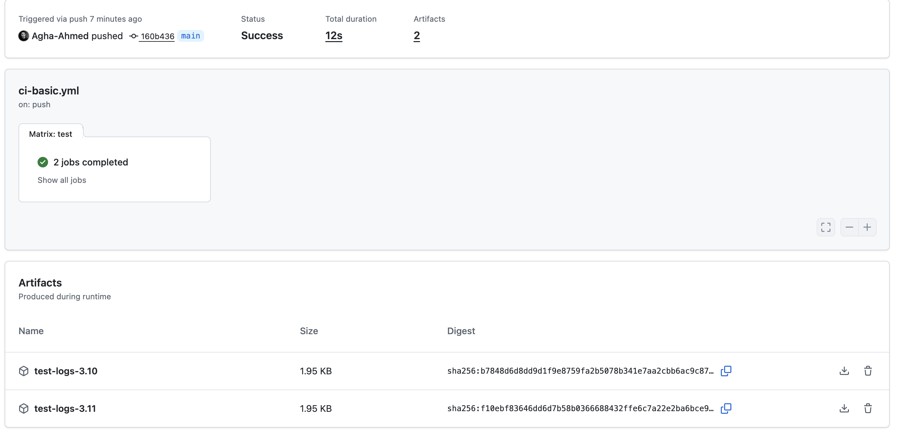

# Week 2 – Day 3: Artifacts

The CI pipeline uploads test logs as artifacts for each Python version in the matrix.

Artifacts created:
- test-logs-3.10
- test-logs-3.11

These can be downloaded from the GitHub Actions UI.

This helps in debugging failures and reviewing test output from each environment.

