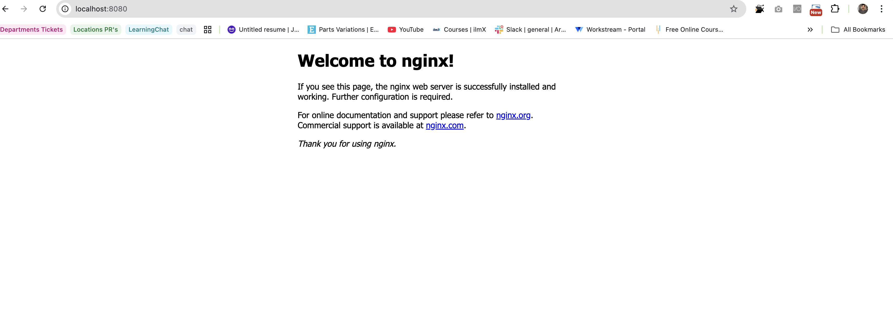

# Week 3 – Day 1 – Task 2 (Nginx Container)

## Run nginx container
docker run -d -p 8080:80 --name my-nginx nginx

## Verify container is running
docker ps

Container shows:
- Image: nginx
- Status: Up
- Port mapping: 8080 -> 80

## Verify service
Browser: http://localhost:8080
OR
Bash: curl http://localhost:8080

