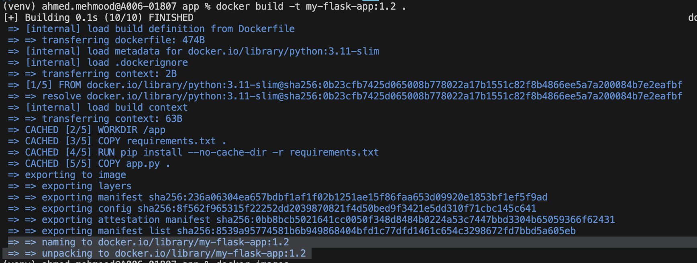
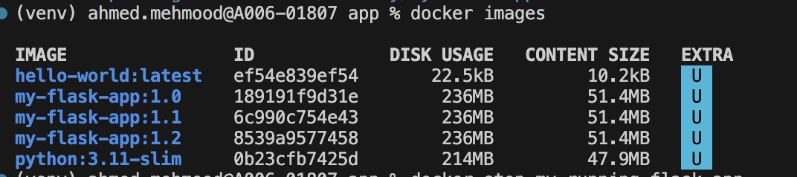
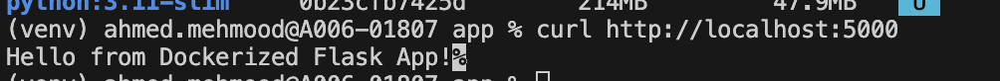
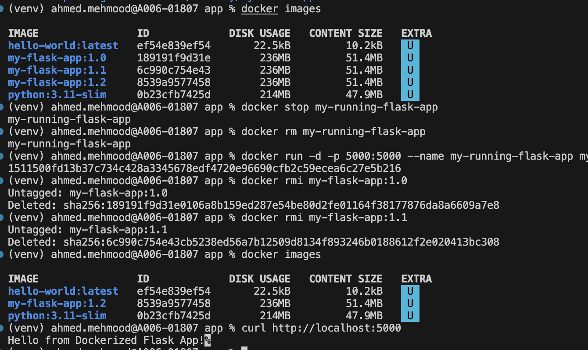

# Week 3 - Day 2: Build & Run Flask App Container

## Task: Build and run Docker image for Flask app

Step 1: Created a Dockerfile `Week-3/Day-2/app/Dockerfile`
- Build your Docker image from the Dockerfile.

Step 2: Build Docker Image
- docker build -t my-flask-app:1.2 .

Output: 

Step 3: List Docker Images
- docker images
Output:

Step 4: Run Container
- docker run -d -p 5000:5000 --name my-running-flask-app my-flask-app:1.2
Output:

Step 5: Verify App
- curl http://localhost:5000

Optional: (Cleanup Practice)
1. Stop old container (if running):
- docker stop my-running-flask-app
- docker rm my-running-flask-app
2.  Delete Old Image
- docker rmi my-flask-app:1.0
- docker rmi my-flask-app:1.1

