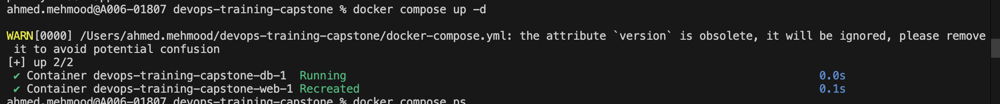
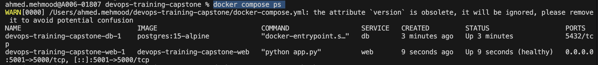
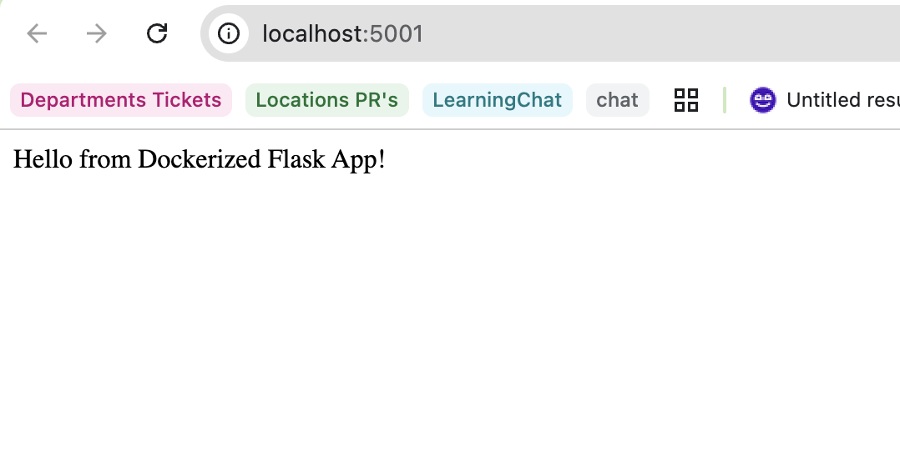
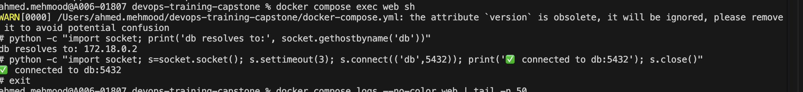

# Week 3 - Day 3: Docker Compose (web + db)

## Compose up
- Command: `docker compose up -d`
- Result: both services running

## Running containers
- Command: `docker compose ps`

## App check
- URL: http://localhost:5001

## Connectivity: web -> db
Verify “app → db” connectivity
- `docker compose exec web sh`
Inside the container run:
- Command:
  - `python -c "import socket; print(socket.gethostbyname('db'))"`
  - `python -c "import socket; s=socket.socket(); s.settimeout(3); s.connect(('db',5432)); print('connected'); s.close()"`
- Output:

## Logs
docker compose logs --no-color web | tail -n 50

WARN[0000] /Users/ahmed.mehmood/devops-training-capstone/docker-compose.yml: the attribute `version` is obsolete, it will be ignored, please remove it to avoid potential confusion 
web-1  |  * Serving Flask app 'app'
web-1  |  * Debug mode: off
web-1  | WARNING: This is a development server. Do not use it in a production deployment. Use a production WSGI server instead.
web-1  |  * Running on all addresses (0.0.0.0)
web-1  |  * Running on http://127.0.0.1:5000
web-1  |  * Running on http://172.18.0.3:5000
web-1  | Press CTRL+C to quit
web-1  | 127.0.0.1 - - [25/Feb/2026 11:36:29] "GET /health HTTP/1.1" 200 -
web-1  | 127.0.0.1 - - [25/Feb/2026 11:36:59] "GET /health HTTP/1.1" 200 -
web-1  | 192.168.65.1 - - [25/Feb/2026 11:37:11] "GET / HTTP/1.1" 200 -
web-1  | 192.168.65.1 - - [25/Feb/2026 11:37:11] "GET /favicon.ico HTTP/1.1" 404 -
web-1  | 127.0.0.1 - - [25/Feb/2026 11:37:29] "GET /health HTTP/1.1" 200 -
web-1  | 127.0.0.1 - - [25/Feb/2026 11:37:59] "GET /health HTTP/1.1" 200 -
web-1  | 127.0.0.1 - - [25/Feb/2026 11:38:29] "GET /health HTTP/1.1" 200 -
web-1  | 127.0.0.1 - - [25/Feb/2026 11:38:59] "GET /health HTTP/1.1" 200 -

docker compose logs --no-color db  | tail -n 50

WARN[0000] /Users/ahmed.mehmood/devops-training-capstone/docker-compose.yml: the attribute `version` is obsolete, it will be ignored, please remove it to avoid potential confusion 
db-1  | creating subdirectories ... ok
db-1  | selecting dynamic shared memory implementation ... posix
db-1  | selecting default max_connections ... 100
db-1  | selecting default shared_buffers ... 128MB
db-1  | selecting default time zone ... UTC
db-1  | creating configuration files ... ok
db-1  | running bootstrap script ... ok
db-1  | sh: locale: not found
db-1  | 2026-02-25 11:32:53.610 UTC [35] WARNING:  no usable system locales were found
db-1  | performing post-bootstrap initialization ... ok
db-1  | syncing data to disk ... ok
db-1  | 
db-1  | initdb: warning: enabling "trust" authentication for local connections
db-1  | initdb: hint: You can change this by editing pg_hba.conf or using the option -A, or --auth-local and --auth-host, the next time you run initdb.
db-1  | 
db-1  | Success. You can now start the database server using:
db-1  | 
db-1  |     pg_ctl -D /var/lib/postgresql/data -l logfile start
db-1  | 
db-1  | waiting for server to start....2026-02-25 11:32:53.864 UTC [41] LOG:  starting PostgreSQL 15.16 on aarch64-unknown-linux-musl, compiled by gcc (Alpine 15.2.0) 15.2.0, 64-bit
db-1  | 2026-02-25 11:32:53.865 UTC [41] LOG:  listening on Unix socket "/var/run/postgresql/.s.PGSQL.5432"
db-1  | 2026-02-25 11:32:53.867 UTC [44] LOG:  database system was shut down at 2026-02-25 11:32:53 UTC
db-1  | 2026-02-25 11:32:53.869 UTC [41] LOG:  database system is ready to accept connections
db-1  |  done
db-1  | server started
db-1  | CREATE DATABASE
db-1  | 
db-1  | 
db-1  | /usr/local/bin/docker-entrypoint.sh: ignoring /docker-entrypoint-initdb.d/*
db-1  | 
db-1  | waiting for server to shut down....2026-02-25 11:32:53.992 UTC [41] LOG:  received fast shutdown request
db-1  | 2026-02-25 11:32:53.992 UTC [41] LOG:  aborting any active transactions
db-1  | 2026-02-25 11:32:53.994 UTC [41] LOG:  background worker "logical replication launcher" (PID 47) exited with exit code 1
db-1  | 2026-02-25 11:32:53.994 UTC [42] LOG:  shutting down
db-1  | 2026-02-25 11:32:53.994 UTC [42] LOG:  checkpoint starting: shutdown immediate
db-1  | 2026-02-25 11:32:54.018 UTC [42] LOG:  checkpoint complete: wrote 921 buffers (5.6%); 0 WAL file(s) added, 0 removed, 0 recycled; write=0.007 s, sync=0.016 s, total=0.025 s; sync files=301, longest=0.006 s, average=0.001 s; distance=4238 kB, estimate=4238 kB
db-1  | 2026-02-25 11:32:54.021 UTC [41] LOG:  database system is shut down
db-1  |  done
db-1  | server stopped
db-1  | 
db-1  | PostgreSQL init process complete; ready for start up.
db-1  | 
db-1  | 2026-02-25 11:32:54.105 UTC [1] LOG:  starting PostgreSQL 15.16 on aarch64-unknown-linux-musl, compiled by gcc (Alpine 15.2.0) 15.2.0, 64-bit
db-1  | 2026-02-25 11:32:54.105 UTC [1] LOG:  listening on IPv4 address "0.0.0.0", port 5432
db-1  | 2026-02-25 11:32:54.105 UTC [1] LOG:  listening on IPv6 address "::", port 5432
db-1  | 2026-02-25 11:32:54.106 UTC [1] LOG:  listening on Unix socket "/var/run/postgresql/.s.PGSQL.5432"
db-1  | 2026-02-25 11:32:54.108 UTC [57] LOG:  database system was shut down at 2026-02-25 11:32:54 UTC
db-1  | 2026-02-25 11:32:54.110 UTC [1] LOG:  database system is ready to accept connections
db-1  | 2026-02-25 11:37:54.111 UTC [55] LOG:  checkpoint starting: time
db-1  | 2026-02-25 11:37:58.373 UTC [55] LOG:  checkpoint complete: wrote 44 buffers (0.3%); 0 WAL file(s) added, 0 removed, 0 recycled; write=4.250 s, sync=0.004 s, total=4.262 s; sync files=12, longest=0.003 s, average=0.001 s; distance=252 kB, estimate=252 kB

## Persistent Storage Verification
Command:
- docker volume ls

Output:
devops-training-capstone_postgres_data
