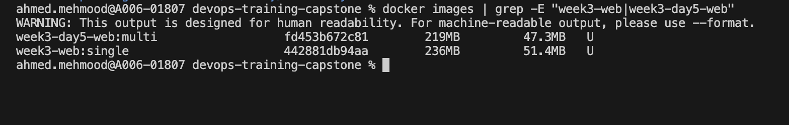

# Week 3 – Day 5: Docker Image Size Comparison

## Objective
Measure image size before and after multi-stage optimization.

---

## Images Compared

### Before Optimization (Single-stage)
- Image: `week3-web:single`
- Built from: Week-3 Day-4 Dockerfile
- Size: **236MB**
- Build “Before” image (single-stage) : `docker build -t week3-web:single ./Week-3/Day-4/web`

### After Optimization (Multi-stage)
- Image: `week3-day5-web:multi`
- Built from: Week-3 Day-5 multi-stage Dockerfile
- Size: **219MB**
- Build “After” image (multi-stage): `docker build -t week3-day5-web:multi ./Week-3/Day-5/web`
---
Capture sizes: `docker images | grep -E "week3-web|week3-day5-web"`
## Size Difference

- Reduced by: **17MB**
- Multi-stage image is smaller and cleaner.

## Conclusion

Multi-stage builds improve efficiency and are recommended for production-ready container images.