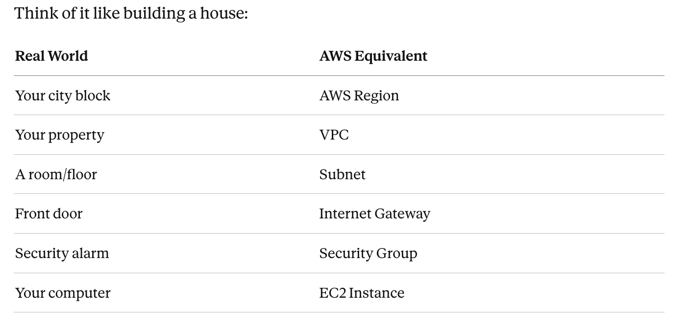
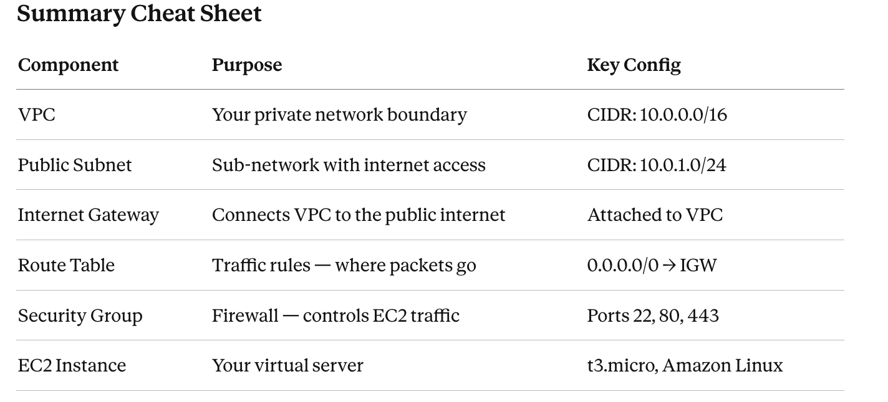

# Week 4 – Day 2 – AWS Network Design

## 1. VPC Configuration
VPC CIDR Block: 10.0.0.0/16
- This provides a large private IP range for resources.

## 2. Public Subnet
Subnet CIDR: 10.0.1.0/24
- This subnet will host the EC2 web server.
- Why public?
Because it will connect to the Internet Gateway.

## 3. Internet Gateway (IGW)
The Internet Gateway is attached to the VPC.
- Purpose:
Allows internet traffic to enter and leave the VPC.

## 4. Route Table
Route Table Rules:
- 10.0.0.0/16 → local
- 0.0.0.0/0 → Internet Gateway
- Explanation:
Any traffic going to the internet (0.0.0.0/0) is sent to the IGW.
This makes the subnet PUBLIC.

## 5. EC2 Instance
The EC2 web server is deployed inside the public subnet.
Settings:
- Public IPv4 enabled
- Associated with Security Group

## 6. Security Group Rules
Inbound Rules:
- SSH (Port 22) → MY_PUBLIC_IP/32
- HTTP (Port 80) → 0.0.0.0/0

Outbound Rules:
- Allow all (default)

Explanation:
- SSH is restricted to my IP for security.
- HTTP is open to allow public access.

## 6. Traffic Flow Explanation

User → Internet → Internet Gateway → Route Table → Public Subnet → EC2 → Security Group check → Response back to user

All components must exist for internet access to work.

---------------------------------------------

# What is a VPC?
A VPC (Virtual Private Cloud) is your own private, isolated section of the AWS cloud.

Without a VPC, your servers would be exposed directly to the internet with no control. A VPC lets you define who can enter, who can leave, and how traffic flows.

## Visual Diagram

INTERNET
    │
    │  ← HTTP/HTTPS/SSH requests
    ▼
┌──────────────────────┐
│  INTERNET GATEWAY    │  ← Entry/Exit door for the VPC
│  igw-0abc1234        │
└──────────┬───────────┘
           │
           │  Route Table: 0.0.0.0/0 → igw-0abc1234
           │
╔══════════╪══════════════════════════════════════╗
║  VPC     │    10.0.0.0/16                       ║
║          │                                      ║
║  ┌───────▼─────────────────────────────────┐    ║
║  │  PUBLIC SUBNET   10.0.1.0/24            │    ║
║  │                                         │    ║
║  │  ╔═════════════════════════════════╗    │    ║
║  │  ║  SECURITY GROUP  sg-0xyz456     ║    │    ║
║  │  ║                                 ║    │    ║
║  │  ║  ┌─────────────────────────┐    ║    │    ║
║  │  ║  │   EC2 INSTANCE          │    ║    │    ║
║  │  ║  │   Amazon Linux 2        │    ║    │    ║
║  │  ║  │   t3.micro              │    ║    │    ║
║  │  ║  │   Private IP: 10.0.1.10 │    ║    │    ║
║  │  ║  │   Public  IP: 54.x.x.x  │    ║    │    ║
║  │  ║  └─────────────────────────┘    ║    │    ║
║  │  ╚═════════════════════════════════╝    │    ║
║  └─────────────────────────────────────────┘    ║
╚═════════════════════════════════════════════════╝

## Component Explanations

1. VPC — Virtual Private Cloud
- Your own isolated network inside AWS.
- Keeps your resources (servers, databases) separated from other AWS customers
- You control all IP addresses, routing, and access rules
- Required before you can launch any EC2 instance
Key setting: CIDR Block = 10.0.0.0/16
- This gives you 65,536 IP addresses to work with
- You decide how to split them into subnets

2. Public Subnet
- A subdivision of your VPC that has access to the internet.
- Not everything should be public — databases, internal apps should be private
- A public subnet lets your EC2 server accept web traffic
- Separating concerns (public vs. private) is a security best practice

Key setting: CIDR = 10.0.1.0/24
- Gives 256 IP addresses in this subnet (10.0.1.0 → 10.0.1.255)
- Placed in one Availability Zone (us-east-1a) for redundancy

3. Internet Gateway (IGW)
- A gateway that connects your VPC to the public internet.
- Without this, NOTHING in your VPC can reach or be reached from the internet
- It's like the front door of your building — traffic must pass through it
- One IGW handles all inbound AND outbound internet traffic for the VPC
How it works:
Internet → IGW → Route Table → Subnet → EC2
EC2 → Route Table → IGW → Internet

Key detail: You must:

Create the IGW
Attach it to your VPC
Add a route: 0.0.0.0/0 → igw-id in your Route Table

4. Security Group
- A virtual firewall that controls traffic to and from your EC2 instance.
- Blocks unwanted traffic at the instance level
- Works on a "deny all by default" model — you only allow what you explicitly permit
- if you allow inbound traffic, the response is automatically allowed out

Why each rule exists:
- PortProtocolReason22TCP/SSHRemote login to manage the server from your computer80TCP/HTTPServe regular web pages (non-encrypted)443TCP/HTTPSServe secure web pages (encrypted) — - required for modern sites
- Outbound: All traffic allowed — your server needs to download updates, call APIs, etc.

⚠️ Security Tip: In production, restrict Port 22 (SSH) to only your IP address, not 0.0.0.0/0 (the whole internet).

5. EC2 Instance
- A virtual server running in your subnet.
- This is where your application code actually runs
- AWS manages the physical hardware; you manage the operating system and apps

## Traffic Flow Summary
User types your website URL in browser
         │
         ▼
    DNS resolves to your EC2's Public IP (54.x.x.x)
         │
         ▼
    Request hits Internet Gateway
         │
         ▼
    Route Table: sends to Public Subnet
         │
         ▼
    Security Group checks: Is port 80 or 443 allowed? ✅
         │
         ▼
    EC2 Instance receives the request and responds
         │
         ▼
    Response goes back through IGW → Internet → User's browser ✅