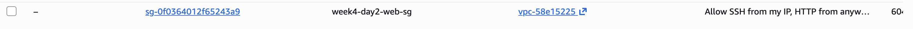

# Week 4 – Day 2 – Security Group Rules

Security Group Name: week4-day2-web-sg
Security Group ID: sg-0f0364012f65243a9
VPC: Default VPC

Inbound Rules:
1) SSH (22) from MY_IP
   - Source: 103.84.54.36/32
   - Reason: Restrict admin access to my network only

2) HTTP (80) from 0.0.0.0/0
   - Reason: Allow anyone to reach the web server (training only)

Outbound Rules (default)

