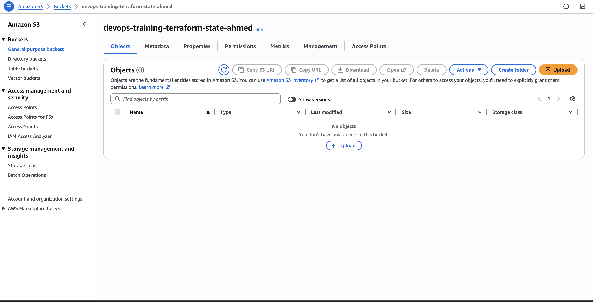

# Week 4 – Day 4 – Remote State Setup (S3)

## What I changed
- Added S3 backend configuration in `backend.tf`.

## What I ran
- aws sso login --profile training
- terraform init

During `terraform init`, I selected **yes** to migrate existing local state to the S3 backend.

## Verification
- Terraform now uses S3 as backend for `terraform.tfstate`.
- State is no longer stored locally.

