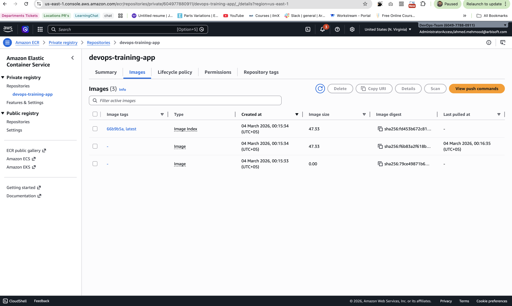

# Week 5 Day 1 — ECR Push

## Objective
Push locally built Docker image to AWS ECR for future ECS deployment.

## Local image used: 
- week3-day5-web:multi
- Verified using: `docker images`

## ECR Repository

Repository created:
- Name: `devops-training-app`
- Region: us-east-1
- Type: Private

## Authentication
Authenticated Docker to ECR:

aws ecr get-login-password \
  --region us-east-1 \
  --profile training | \
docker login \
  --username AWS \
  --password-stdin 604977880911.dkr.ecr.us-east-1.amazonaws.com

## Tagging & Push

Tagged image with:
- `latest`
- `<commit-sha>`
### Tag image as latest
docker tag week3-day5-web:multi \
604977880911.dkr.ecr.us-east-1.amazonaws.com/devops-training-app:latest 

### Tag image with commit SHA
- Get your repo commit SHA: `git rev-parse --short HEAD`
docker tag week3-day5-web:multi \
<ACCOUNT_ID>.dkr.ecr.us-east-1.amazonaws.com/devops-training-app:66b9b5a

## Pushed to ECR:
docker push <ACCOUNT_ID>.dkr.ecr.us-east-1.amazonaws.com/devops-training-app:latest
docker push <ACCOUNT_ID>.dkr.ecr.us-east-1.amazonaws.com/devops-training-app:<commit-sha>

## Result
### Verified both tags in AWS Console under:
ECR → devops-training-app → Images
