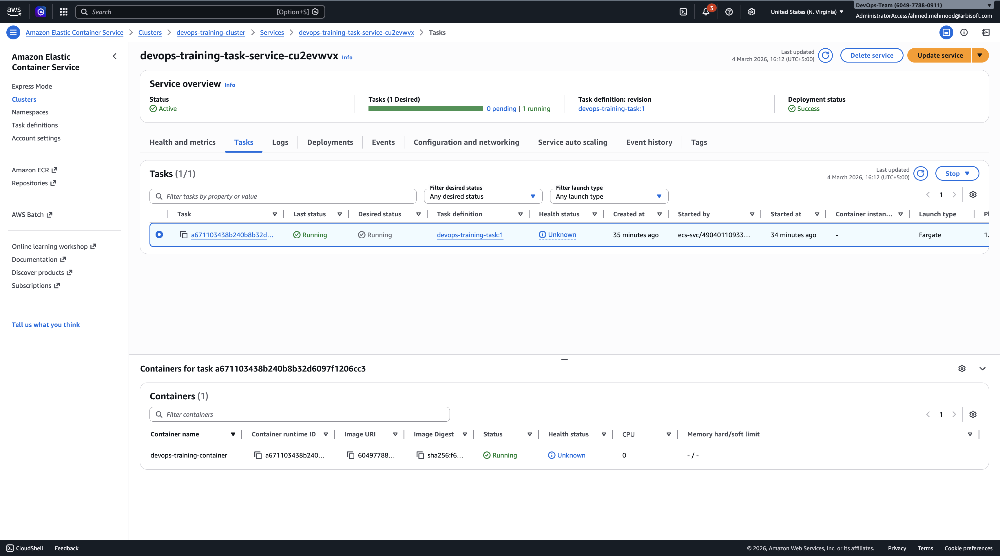
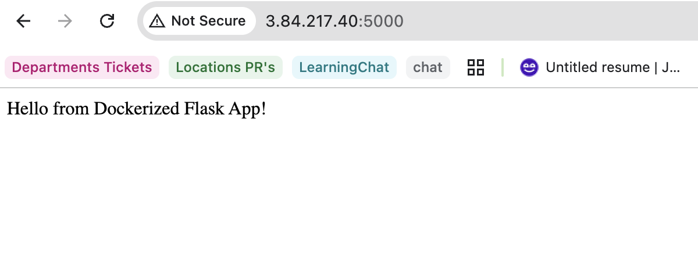
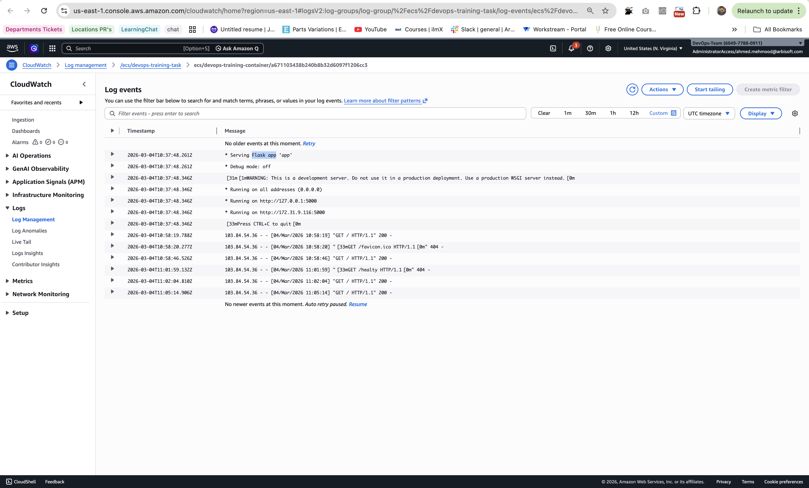

# Week 5 Day 2 — ECS Setup

## ECS Cluster
Name: devops-training-cluster  
Launch type: AWS Fargate  
Region: us-east-1 

## Task Definition
Family: devops-training-task  
Container: devops-training-container

Image:
604977880911.dkr.ecr.us-east-1.amazonaws.com/devops-training-app:latest

Port:
3000/TCP

Task Size:
CPU: 0.25 vCPU  
Memory: 1 GB

Logging:
CloudWatch logs enabled

## Task 2 — Run ECS Service and Verify Response
### Deployment
- ECS Cluster: devops-training-cluster
- ECS Service: devops-training-task-service-cu2evwvx
- Task Definition: devops-training-task
- Image: 604977880911.dkr.ecr.us-east-1.amazonaws.com/devops-training-app:latest

## Verification
- Task status: RUNNING
- Public IP: 3.84.217.40
- Working URL:
  - http://3.84.217.40:5000

  

### Service Verification (curl)
Command used: `curl -i http://3.84.217.40:5000`

Output:

HTTP/1.1 200 OK
Server: Werkzeug/3.1.6 Python/3.11.14
Date: Wed, 04 Mar 2026 11:05:14 GMT
Content-Type: text/html; charset=utf-8
Content-Length: 32
Connection: close

Hello from Dockerized Flask App!

## Task 3 — CloudWatch Logs
Container logs are successfully streamed to CloudWatch.

Step1: ECS → Clusters → devops-training-cluster
Step2: Services → devops-training-task-service-cu2evwvx
Step3: Then click: Tasks → Click the running task
Step4: Scroll down to → Containers → click View in CloudWatch
AWS will open CloudWatch Logs: CloudWatch > Log management >/ecs/devops-training-task
