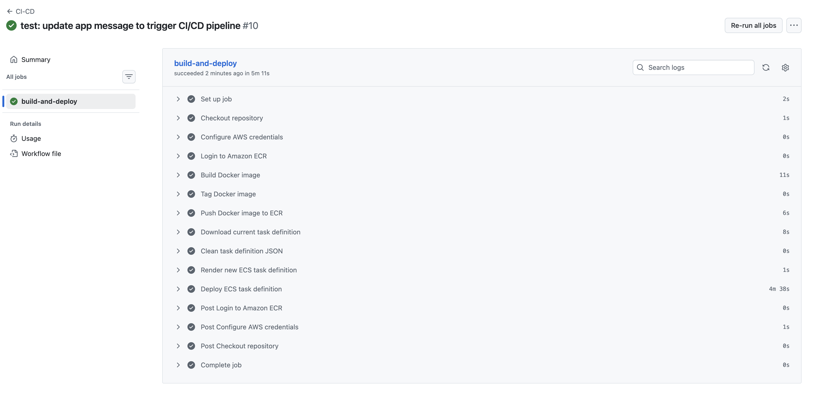
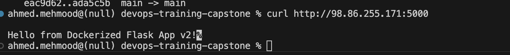

# Day 3 Week 5 
## Output required 

### Watch the pipeline
1. Go to: GitHub → Actions and Open the latest run.
2. Pipeline Run URL: https://github.com/Agha-Ahmed/devops-training-capstone/actions/runs/22784150407
build-and-deploy
✓ succeeded

## Verify the running app
- Run: curl http://34.235.162.81:5000
- Expected output:

Hello from Dockerized Flask App v2!
