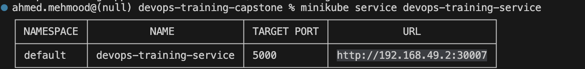
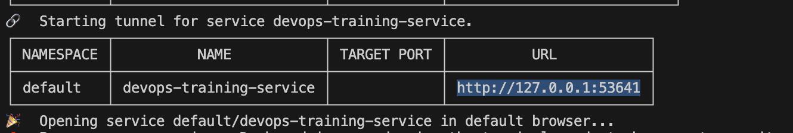
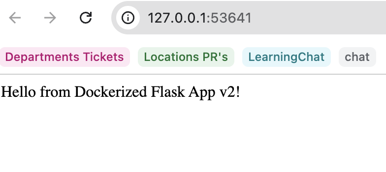

# Day 4 – Kubernetes Deployment

## Objective
Deploy the containerized application to a local Kubernetes cluster using Minikube.

## Steps Performed

1. Built the Docker image inside the Minikube Docker environment.
2. Created Kubernetes deployment and service manifests.
3. Applied manifests using kubectl.
4. Verified pod status.
5. Exposed the application using a NodePort service.

## Commands Used

- kubectl apply -f k8s/deployment.yaml
- kubectl apply -f k8s/service.yaml
- kubectl get pods
- kubectl get services
- minikube service devops-training-service

## Pod Status
devops-training-app-94697846f-kdtxt 1/1 Running

## Service URL
- http://192.168.49.2:30007

- Minikube tunnel provided a local access URL: http://127.0.0.1:53641

## Result
The application was successfully deployed to Kubernetes and accessed through the service endpoint.

