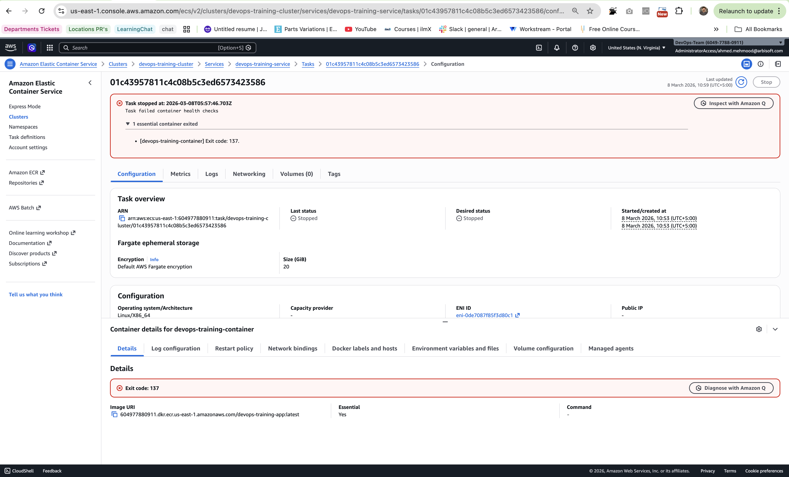
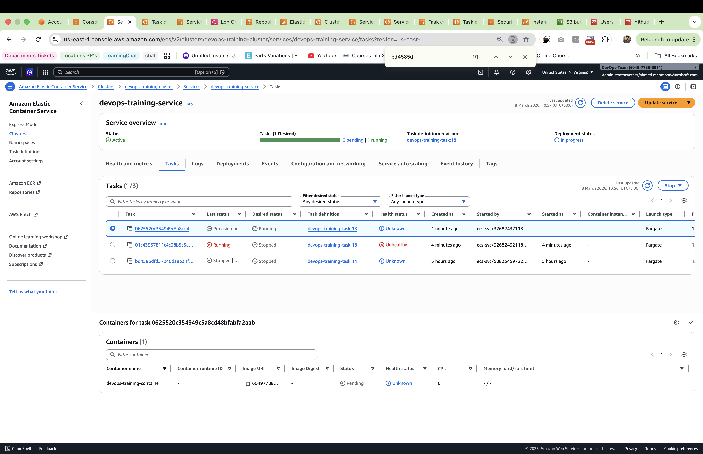
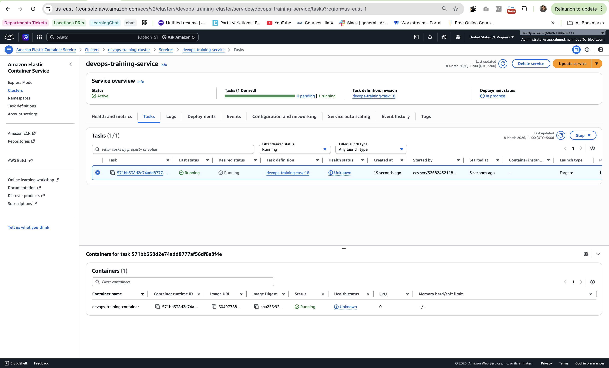

# Deployment Failure Scenario

## Objective
Simulate a failing deployment and observe how ECS reacts.

## Steps

1. Modified the application code to intentionally cause a failure.
2. Pushed the change to the main branch.
3. CI/CD pipeline built the Docker image and deployed it to ECS.

## Observation

After deployment, the ECS task failed container health checks and stopped.

Error shown:

Task failed container health checks  
Essential container exited  
Exit code: 137

ECS automatically launched a replacement task because the service desired count was set to 1.

## Result

This demonstrates ECS self-healing behavior where failed containers are automatically replaced to maintain service availability.

