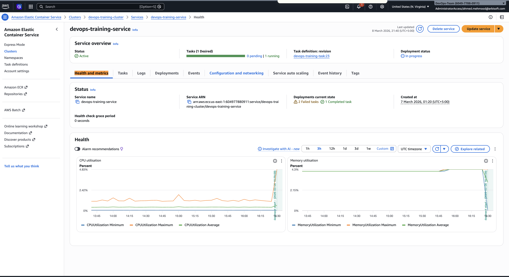

# Key Metrics for ECS Service

## CPU Utilization

CPU Utilization shows how much CPU resources the container is using.

Why it is important:
- Detect high traffic or heavy load on the service
- Identify performance bottlenecks
- Helps determine when scaling may be required

---

## Memory Utilization

Memory Utilization shows how much memory the container is consuming.

Why it is important:
- Detect memory leaks
- Prevent container crashes
- Monitor application stability

---

These metrics help monitor the health and performance of the ECS service and are useful for debugging production issues.

