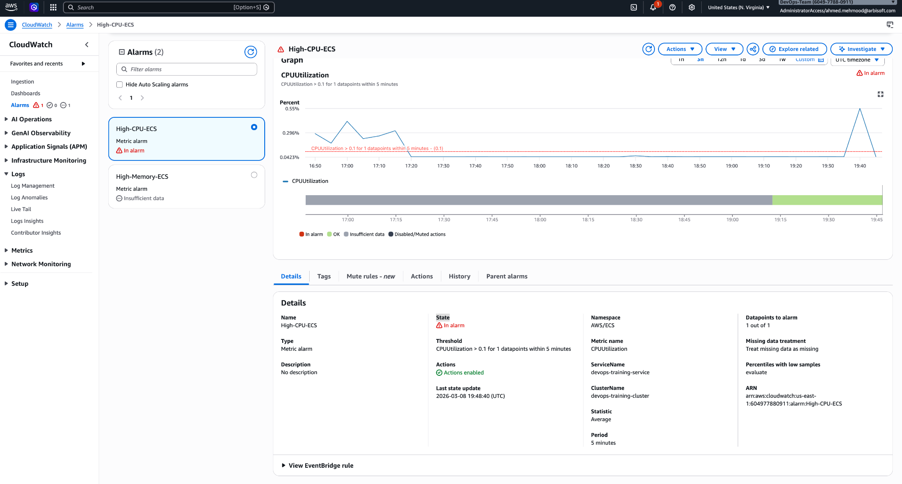
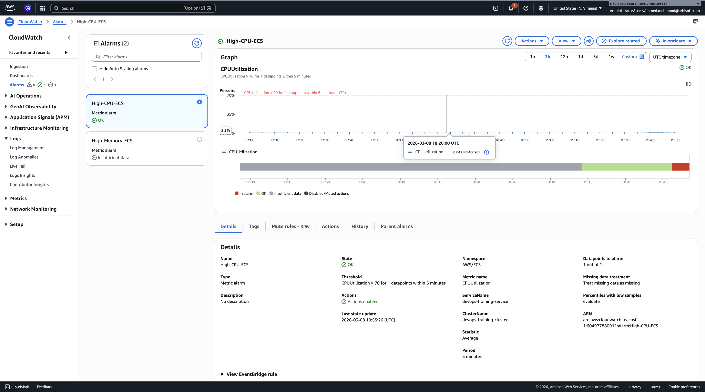

# CloudWatch Alarm Test

## Alarm Tested
High-CPU-ECS

## Test Method
The CPU alarm threshold was temporarily lowered to simulate an alarm.

Original threshold:
CPUUtilization > 70

Temporary test threshold:
CPUUtilization > 0.1

## Result
The alarm successfully entered the ALARM state when CPU utilization exceeded the test threshold.

CloudWatch correctly detected the condition and triggered the alarm.

## Cleanup
After testing, the threshold was restored to:
CPUUtilization > 70

