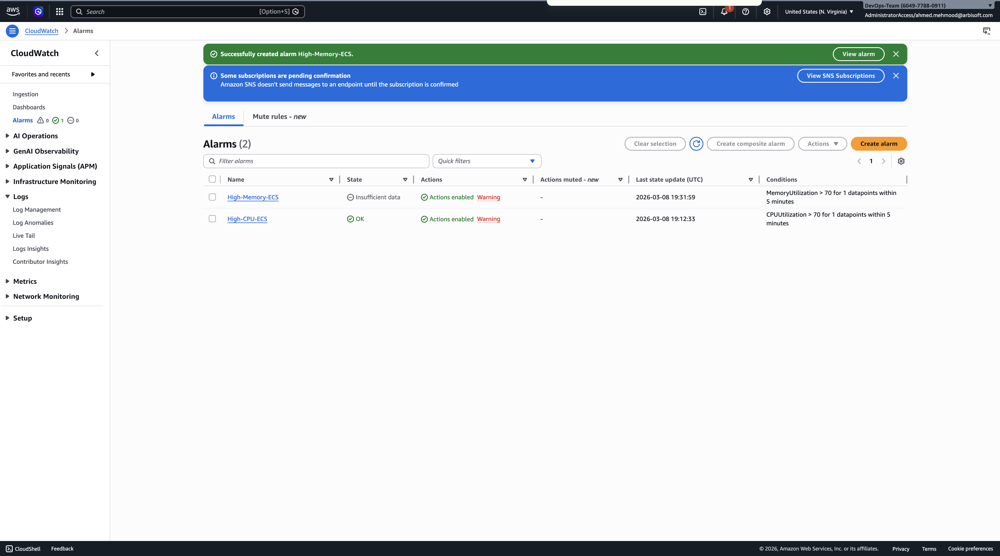

# CloudWatch Alarms

Two alarms were created to monitor ECS service health.

Alarm 1:
High-CPU-ECS
CPUUtilization > 70%

Alarm 2:
High-Memory-ECS
MemoryUtilization > 70%

These alarms notify engineers when resource usage becomes too high.
