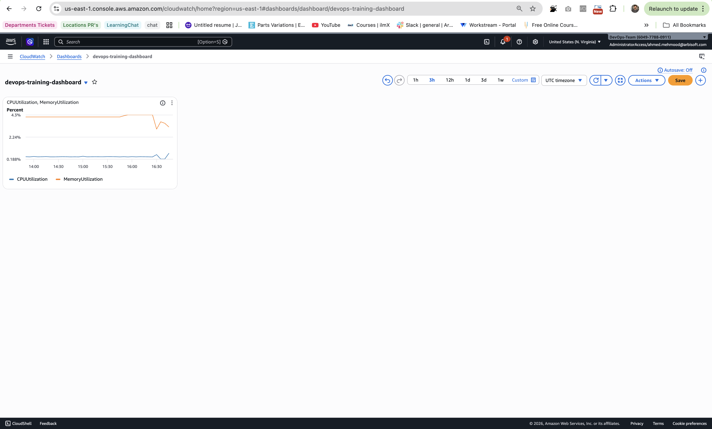

# CloudWatch Dashboard

Dashboard Name:
devops-training-dashboard

Metrics Added:
- CPUUtilization
- MemoryUtilization

Step 1 — Open CloudWatch
Go to:
- AWS Console -> CloudWatch
- Left menu -> Dashboards

Step 2 — Create Dashboard
- Click -> Create dashboard
- Enter name: devops-training-dashboard
- Click -> Create

Step 3 — Add Widget
- Select -> Line
- Click -> Next

Step 4 — Select Metrics
- Navigate to -> ECS -> ClusterName
- Select metrics:
    1. CPUUtilization
    2. MemoryUtilization
- For cluster:
    devops-training-cluster
- Click -> Create widget

Step 5 — Save Dashboard
Click -> Save dashboard

Results: 
Now your dashboard will show:
CPU Utilization graph
Memory Utilization graph

The dashboard provides a visual overview of the ECS service performance and helps monitor resource usage in real time.
