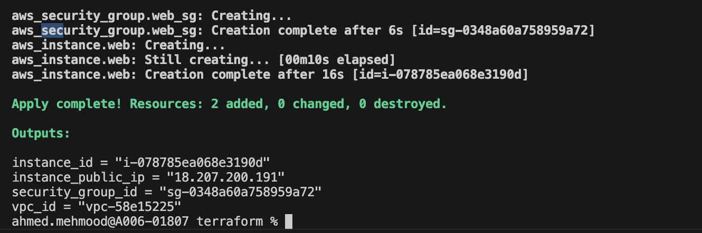
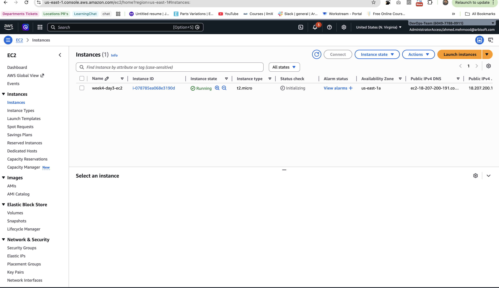
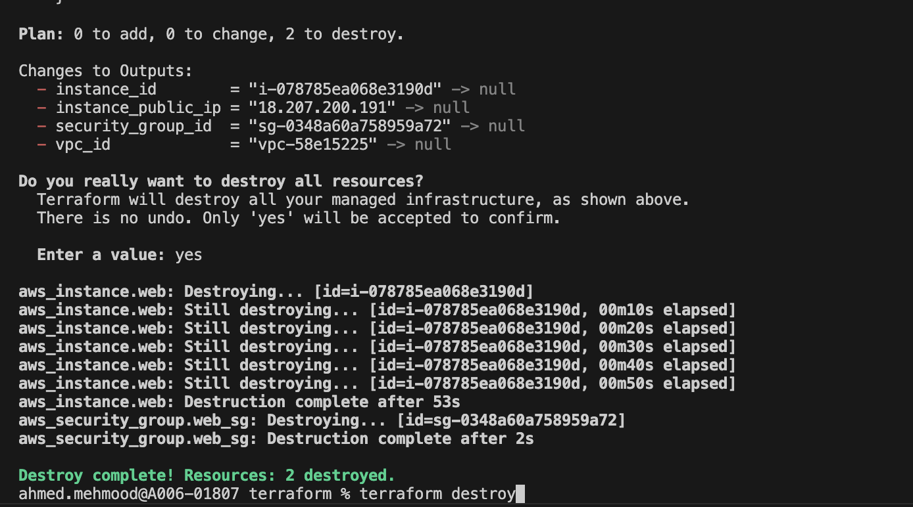
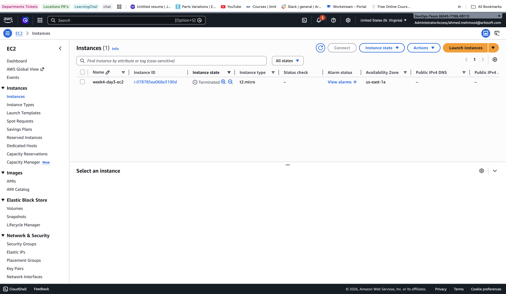

# Week 4 – Day 3 – Terraform Apply & Destroy

## Terraform Apply

Command:
terraform apply

Result:
- Created Security Group
- Created EC2 Instance
- Apply complete! Resources: 2 added

Verified:
- EC2 instance visible in AWS console (running state)

 

---

## Terraform Destroy

Command:
terraform destroy

Result:
- EC2 instance destroyed
- Security group destroyed
- Destroy complete! Resources: 2 destroyed

Verified:
- No EC2 instances remain in console

---

## Key Learning

Terraform allows full lifecycle management:
- Create infrastructure
- Update infrastructure
- Destroy infrastructure

This ensures reproducibility and prevents resource leaks.